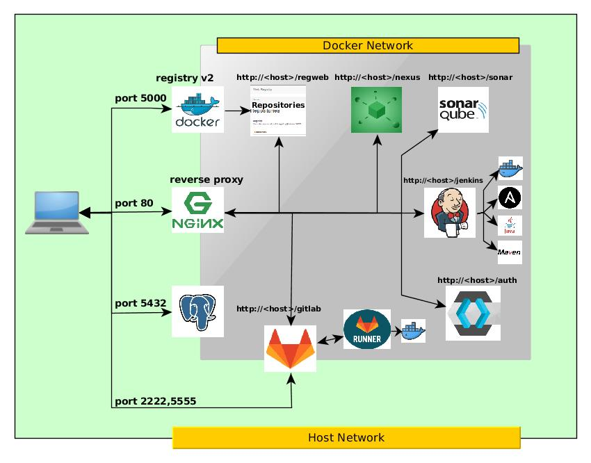

## docker-local-build-environment

##### Tired of endless installation and configuration .... ?!

My personal solution is a local, docker-based CI/CD Build Environment ready in a few minutes to offer you a reade-to-use convenience playground with
* Jenkins 
  * open-jdk
  * maven
  * ansible
  * docker
* Gitlab 
  * and a docker based gitlab-runner registrated
  * secured docker-registry ready (openssh certificate)
  * push with ssh available at port 2222
* Nexus 3
* Sonar
* Postgres (used by Sonar and YOUR applications)
* Standard Docker-Registry V2 with a simple UI
* Portainer to check your setup

so you can be your own local "DevOp"; nearly every category of [periodic table of devoptools][4] has one tool in your local setup. 

#### just a "docker-compose up.." gives you this !



## This is NOT for any cluster (Swarm/Kubernetes)

### System requirements
* At least 8GB Memory with 3GB Swap and 10GB Disk-Space, 16GB ist recommended
* docker version >= 17.06.0
* docker-compose version >= 1.15.0

#### Listenports to be claimed on your host

|Port  |  Why  |
|---|---|
|80 |NGINX, forwards requests to internal docker-containers   |
|5432 |postgres standard connection port |
|2222 |ssh port of gitlab, used to push via ssh connection ssh://git@myHOST:2222/scott/foo.git |
|5555 |Gitlab docker-registry secured with GitLab credentials |
|5000 |Standard Docker-Registry v2 not secured|

If your change the ports in the docker-compose.yml change them also in nginx-reverse/nginx.conf (stream {...} )
## Installation

### Important: First use ./setupEnvironment.sh

The ./setupEnvironment.sh 
* configures your settings and generates a .env File used by docker-compose 
* copies some configuration File to your local directory
* Donloads all the Jenkins-Plugins to jenkins-fat/Plugins directory to save time.
* generates ssl-keys and certificates to use with git clone and the docker registry
  

Bring up your own DevOp Playground  ... just do a

### setup without sonar, takes 7GiB
```
 git clone https://github.com/Springjunky/docker-local-build-environment.git
 cd docker-local-build-environment
 sudo ./setupEnvironment.sh
 docker-compose up --build 
```
starts 9 container

### setup with sonar, takes 10GiB
```
 git clone https://github.com/Springjunky/docker-local-build-environment.git
 cd docker-local-build-environment
 sudo ./setupEnvironment.sh
 docker-compose -f docker-compose.yml -f docker-compose-sonar.yml  up --build 
```
starts 10 container

### The first startup takes a long time (especially gitlab), so be patient
open your favorite browser (_not_ at localhost, use the $(hostname)/jenkins )
to prevent jenkins spit out "your reverse proxy is wrong")

### Ready !

Now you are ready to go with a little CI/CD Environment:
```
 Jenkins  http://<your-host-name>/jenkins
 Nexus  http://<your-host-name>/nexus
 Gitlab  http://<your-host-name>/gitlab
 Sonar  http://<your-host-name>/sonar
 Portainer http://<your-host-name>/portainer
 Docker-Registry-Ui: http://<your-host-name>/regweb 
 Postgres: At standard listenport 5432 for your jdbc-connection-string 
           stream-passthrough to postgres-container.
```
#### Security
... not really, its all http .. don't worry about it! It's only local communication

##### security paranoia
See Readme in folder security-paranoia if you want to have some hints how to configure your firewall.

### Logins and Passwords
|Image  |  User  |  Password |
|---|---|---|
|Jenkins| admin| admin |
|Nexus   | admin | admin123 |
|Gitlab  | root  | gitlab4me |
|Sonar | admin | admin |
|Postgres|postgres|admin|

## The Tools
There are some configurations you have to do after setup.
*Remember:* At every time use your real hostname and NOT localhost (locahost inside a container is the container itself).

For example: If you configure a GitLab-Connection in Jenkins, you will reach Gitlab at http://&lt;your host&gt;/gitlab and not http://localhost/gitlab
### Jenkins
* MAVEN_HOME is /opt/maven
* JAVA_HOME is /usr/lib/jvm/java-8-openjdk-amd64

###  GitLab
* the docker-registry from GitLab is at port 5555 (and secured with an openssl certificate ..thats part of
  setupEnvironment.sh), just create a project in gitlab and click at the registry tab to show
  how to login to the project registry and how to tag your images and upload them.
* ssh cloning and pushing is at port 2222 (ssh://git@myHOST:2222/scott/foo.git remeber to upload your public key before, should be ~/.ssh/id_rsa.pub )
* http cloning and pushing is only http NOT https

#### gitlab-runner
The runner is a gitlab-multirunner image with a docker-runner (concurrent=1) , based on [gitlab/gitlab-runner][2]  at every startup any runner is removed 
and only ONE new runner is registrated to avoid multiple runners  (the pipeline-history maybe lost.) 
setups with a shell-runner works, docker-in-docker (docker:dind) or docker based builds should cause trouble because the 
default DNS-Server of a docker-container ist 8.8.8.8 (google) see this link [extra_host for servce][5] for a possible workaround 

It takes a long time until gitlab is ready to accept a runner registration, if it fails, increase the REGISTER_TRYS in docker-compse.yml

#### Jenkins and Gitlab

Gitlab is very very fast with new releases and sometimes the api has breaking changes. If something does not work take a look at the Jenkins Bugtracker.

### Sonar
You need to install some rules (Administration - System - Update Center - Available - Search: Java)

### Postgres
You can use any tool to connect to the database at localhost:5432 this is a pass through to the container so any
JDBC-Connection should work

### The Docker-Registries
* NEXUS-Docker-Registry ist NOT configured .. needs a pass trough and some more configs, see [Unsecure docker-registry in Nexus][1] feel free to provide a push-request
* GitLab docker-registry is at port 5555 you have to use your GitLab Credentials from the corresponding git-respository
* standard Docker-Registry v2 ist at standard port 5000 with no credentials, so eays-to-use


## Troubleshooting
##### check Hostname and IP
In most cases a wrong HOSTNAME:HOSTIP causes trouble, to check this try the following.
* log into the jenkins-fat container (with id)
```
  docker container ls
  docker container exec -it jenkins-fat bash
  chmod a+rw /tmp
  apt-get update
  apt-get install -y --allow-unauthenticated iputils-ping
  ping jenkins
  ping gitlab
  ping <your local hostname>
```
every ping must work, if not, check the .env file, is there the correct DC_HOSTNAME / DC_HOSTIP ?

##### changed interface ip ?
  If you change your network (switching between home/office/lan/wifi) your ip-address
  could be change and the container is not able to resolve your host any more
  Check the .env file or just run the setup-Script again. 

##### consider low memory:
  with an amount lower than 8GB sonar and embedded eleastic search did not startup and no message is displayed


## Starting from scratch
To delete everything an start from scratch (own risk, you will lost all your setting projects and data)
```diff
- WARNING: this will delete EVERY docker-Images and container and ALL your docker-data !!!
```

```
# switch to your home directory
cd 
# delete ALL YOUR Settings and data !!!!!
sudo rm -rf devstack-data/

# delete all downloaded images
docker rmi -f $(docker images -aq)

# delete all startet container
docker container stop $(docker container ls -aq)
docker container prune

# delete docker-container volumes
docker volume prune 

# delete docker-networks
docker network rm dockerlocalbuildenvironment_default dockerlocalbuildenvironment_devstacknetwork

```

### My next steps

* give you some more preconfiguration
* ~~install docker~~
* ~~install docker-compose~~
* ~~install ansible~~
* ~~apply a gitlab runner~~
* ~~apply git-lfs~~
* ~~apply sonar~~
* ~~apply keycloak~~
* ~~apply a better registry~~


[1]: https://support.sonatype.com/hc/en-us/articles/217542177-Using-Self-Signed-Certificates-with-Nexus-Repository-Manager-and-Docker-Daemon
[2]: https://hub.docker.com/r/gitlab/gitlab-runner/
[3]: https://developers.redhat.com/blog/2017/05/25/easily-secure-your-spring-boot-applications-with-keycloak/
[4]: https://xebialabs.com/periodic-table-of-devops-tools/
[5]: https://gitlab.com/gitlab-org/gitlab-runner/issues/2302
